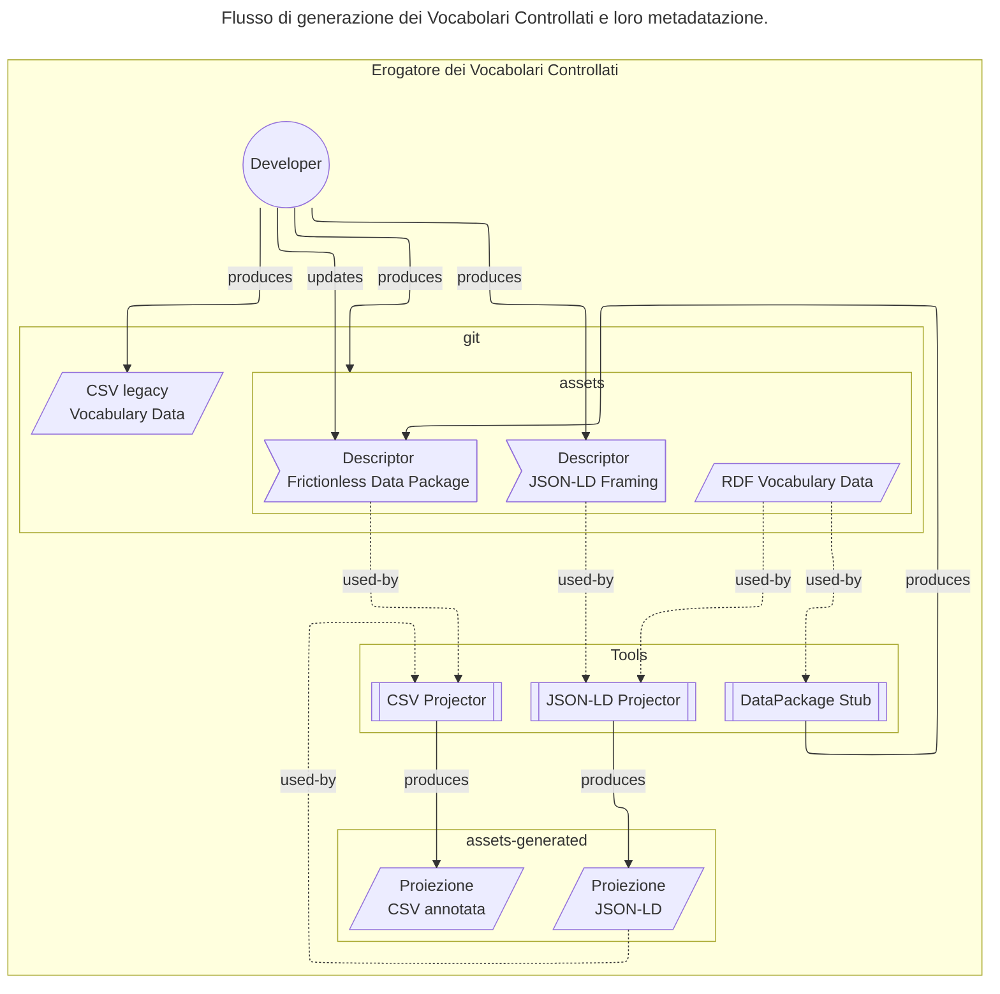

# Generazione e metadatazione dei CSV

[Glossario](glossario.md)

## Introduzione

Il progetto schema.gov.it (National Data Catalog for
Semantic Interoperability) è, insieme alla PDND (Piattaforma
Digitale Nazionale dei Dati), uno dei due cardini della
strategia per l'interoperabilità dell'Italia.

L'obiettivo di schema.gov.it è quello di semplificare la
creazione di servizi pubblici digitali ed API
interoperabili. Questo avviene tramite la catalogazione e la
pubblicazione di ontologie, schemi dati e vocabolari
controllati (codelist, tassonomie) selezionati, insieme a
funzionalità di visualizzazione e ricerca.

In particolare,
i Vocabolari Controllati sono asset semantici contenenti
codelist e tassonomie utilizzate dai servizi pubblici
digitali.

Per rendere più accessibile l'uso delle risorse semantiche,
schema.gov.it fornisce una specifica per la generazione di
dataset in formati più semplici da usare, come CSV e
YAML-LD, a partire dai dataset RDF a grafo.
Inoltre, mette a disposizione uno strumento in PoC
per la generare automaticamente tali dataset.

## Obiettivo

Questo documento definisce i requisiti di un sistema di
generazione e di metadatazione dei CSV su cui basare dei
processi automatizzati per trasformare vocabolari
controllati in formato RDF (text/turtle) in rappresentazioni
lineari (CSV) e strutturate (YAML-LD/JSON) più accessibili e
utilizzabili.

## Descrizione generale

Il meccanismo di metadatazione ha questi obiettivi:

1. Semplificare la fruizione dei vocabolari controllati per
    sviluppatori e PA che necessitano di formati tabulari
    standard
2. Preservare la semantica dei dati mantenendo i
    riferimenti alle ontologie originali tramite annotazioni
    JSON-LD
3. Preservare le informazioni di versioning esistenti nei
    vocabolari attuali
4. Disaccoppiare la distribuzione dei dati dalla loro
    rappresentazione originale RDF, permettendo proiezioni
    personalizzate senza modificare i grafi sorgente
5. Abilitare l'integrazione futura con API REST v1
    attraverso la generazione di proiezioni JSON annotate
    semanticamente

Ad oggi gli Erogatori pubblicano vocabolari controllati in
formato RDF (Turtle) JSON e CSV. Spesso questi CSV sono
generati manualmente, tramite query SparQL o script ad-hoc.
Talvolta vengono pre-elaborati tramite strumenti interattivi
(e.g., Microsoft Excel) portandosi dietro incongruenze o
specifiche idiosincrasie. A regime quindi, si vuole evitare
che schema.gov.it (e.g., l'harvester) debba dipendere da
questi CSV.

La dipendenza dei Fruitori da CSV "legacy" ha complicato
l'evoluzione in chiave semantica dei vocabolari controllati;
Si è deciso quindi di adottare un approccio più strutturato
dove i dati RDF vengono proiettati in un formato strutturato
(YAML-LD/JSON); e in un secondo momento, da questa
rappresentazione strutturata, gli Erogatori che lo
desiderano possono generare CSV standardizzati segueno il
processo descritto in questo documento.



### Relazione tra proiezioni JSON e CSV

1. Gli Erogatori che lo desiderano, possono continuare a
    pubblicare i CSV legacy in modo da mantenere la
    retrocompatibilità con i Fruitori esistenti. In questo
    caso la possibilità di metadatare le informazioni è
    limitata: se i campi del CSV sono il frutto di una
    manipolazione specifica del grafo originale (e.g.,
    unendo i valori di più proprietà, ..) non è detto sia
    possibile ricostruire le relazioni semantiche
    originarie, né associare ad una colonna del CSV una
    proprietà RDF univoca.

2. Gli Erogatori possono passare al nuovo modello di
    generazione automatica delle proiezioni JSON-LD e CSV
    seguendo le regole descritte in questo documento.

3. Le proiezioni JSON-LD generate contengono un
    sottoinsieme delle informazioni semantiche presenti nel
    grafo RDF originale, incluse le proprietà SKOS e i
    riferimenti alle ontologie.

### Modalità di funzionamento

1. Generare metadati strutturati conformi agli standard
    Frictionless Data per facilitare la validazione e l'uso
    dei dataset

Questo approccio garantisce l'interoperabilità tra il mondo
semantico (RDF/SKOS) e quello applicativo (CSV/JSON),
mantenendo la tracciabilità e la coerenza dei dati.

## Requisiti utente

### Limitazioni

1. I vocabolari controllati devono essere espressi in RDF
    utilizzando la terminologia SKOS; ulteriori modelli
    potranno essere supportati in seguito.

2. Le proprietà SKOS minime richieste sono:

- `rdf:type` a `skos:Concept`: per identificare i concetti
    all'interno del vocabolario;
- `skos:prefLabel`: per la label principale del concetto;
- `skos:notation`: per l'identificatore univoco del concetto
    all'interno del vocabolario;
- `skos:inScheme`: per individuare il vocabolario di
    appartenenza. Ulteriori proprietà SKOS possono essere
    utilizzate, a patto che siano presenti con valori
    consistenti su tutti i record.

1. Gli Erogatori sono responsabili, per ogni vocabolario
    controllato, della redazione dei contenuti prodotti,
    inclusi i file di framing JSON-LD e della correttezza
    sintattica e semantica dei CSV generati.

2. La generazione dei CSV e YAML-LD si basa su regole di
    mapping predefinite nei file di framing; modifiche a
    tali regole richiedono l'aggiornamento dei file di
    framing.

3. La creazione delle proiezioni è effettuata dagli
    Erogatori, che devono verificare la correttezza dei dati
    generati prima della pubblicazione.

4. Il codice della PoC non ha requisiti specifici in
    termini di performance; questo non è un problema
    stringente poiché la dimensione dei vocabolari
    controllati è generalmente limitata (tipicamente poche
    migliaia di voci) e il processo di generazione avviene
    offline (e.g., in fase di build del dataset).

5. I campi ritornati potranno essere limitati ai seguenti
    tipi JSON: `string`, `array`, `object`. Questo perché i valori dei
    vocabolari controllati sono definiti tramite specifiche
    XSD che non sono sempre mappabili in tipi JSON più
    complessi (e.g., date, numeri, booleani). La
    deserializzazione dei campi è lasciata ai fruitori.

6. Gli strumenti forniti a supporto della generazione delle
    proiezioni JSON saranno basati su librerie open source
    che implementano le specifiche JSON-LD e RDF: eventuali
    limitazioni e/o bug di tali librerie si rifletteranno
    sugli strumenti stessi.

7. I tool possono processare le entry in batch per ridurre
    l'uso di memoria RAM e migliorare le performance
    complessive. Tuttavia, quando si utilizzano funzionalità
    di embedding (e.g., `@embed: @always`), è possibile che
    le entry nidificate non vengano completamente catturate
    se si estendono oltre i confini del batch. Per questo,
    il default è processare l'intero dataset in un unico
    batch.

8. Completezza delle proiezioni: dipendentemente dai
    criteri di filtering definiti nel file di framing, le
    proiezioni JSON-LD e CSV generate potrebbero non
    includere tutte le risorse presenti nel vocabolario RDF
    originale.

    Esempi:

    - risorse con proprietà obbligatorie mancanti (e.g.,
        `skos:notation`);
    - risorse `@type` diverso da quello definito nel
        framing (e.g., non `skos:Concept`);
    - risorse non esplicitamente appartenenti al
        vocabolario (e.g., `skos:inScheme` mancante o
        diverso).

    Esempio 1: Risorsa con proprietà obbligatoria mancante
    (`skos:notation`)

    ``` turtle
    @prefix skos: <http://www.w3.org/2004/02/skos/core#> .
    @prefix ex: <http://example.org/vocab/> .

    # Risorsa valida - verrà inclusa nella proiezione
    ex:concept001 a skos:Concept ;
        skos:notation "001" ;
        skos:prefLabel "Concetto Valido" ;
        skos:inScheme ex:myVocabulary .

    # Risorsa NON valida - ESCLUSA dalla proiezione
    # Manca skos:notation
    ex:concept002 a skos:Concept ;
        skos:prefLabel "Concetto Senza Notation" ;
        skos:inScheme ex:myVocabulary .
    ```

    Esempio 2: Risorsa con `@type` diverso da quello del
    framing

    ``` turtle
    @prefix skos: <http://www.w3.org/2004/02/skos/core#> .
    @prefix ex: <http://example.org/vocab/> .

    # Risorsa valida - verrà inclusa nella proiezione
    ex:concept003 a skos:Concept ;
        skos:notation "003" ;
        skos:prefLabel "Concetto di tipo skos:Concept" ;
        skos:inScheme ex:myVocabulary .

    # Risorsa NON valida - ESCLUSA dalla proiezione
    # Il tipo è skos:Collection invece di skos:Concept
    ex:collection001 a skos:Collection ;
        skos:notation "C001" ;
        skos:prefLabel "Collezione non Concept" ;
        skos:inScheme ex:myVocabulary .
    ```

    Esempio 3: Risorsa senza appartenenza esplicita al
    vocabolario (`skos:inScheme` mancante o diverso)

    ``` turtle
    @prefix skos: <http://www.w3.org/2004/02/skos/core#> .
    @prefix ex: <http://example.org/vocab/> .
    @prefix other: <http://example.org/other/> .

    # Risorsa valida - verrà inclusa nella proiezione
    ex:concept004 a skos:Concept ;
        skos:notation "004" ;
        skos:prefLabel "Concetto del vocabolario corretto" ;
        skos:inScheme ex:myVocabulary .

    # Risorsa NON valida - ESCLUSA dalla proiezione
    # Manca completamente skos:inScheme
    ex:concept005 a skos:Concept ;
        skos:notation "005" ;
        skos:prefLabel "Concetto senza skos:inScheme" .

    # Risorsa NON valida - ESCLUSA dalla proiezione
    # Appartiene ad un vocabolario diverso
    ex:concept006 a skos:Concept ;
        skos:notation "006" ;
        skos:prefLabel "Concetto di altro vocabolario" ;
        skos:inScheme other:differentVocabulary .
    ```

### Requisiti di base

La specifica:

- descrive come processare un vocabolario controllato RDF
    in formato Turtle (.ttl) modellato secondo l'ontologia
    SKOS per generare un sottoinsieme dei dati in formato
    JSON-LD;
- definisce la mappatura di base tra un sottoinsieme delle
    proprietà SKOS e i campi del JSON-LD risultante;
- definisce la mappatura di base tra un sottoinsieme delle
    proprietà SKOS e le colonne del CSV risultante;
- permette all'Erogatore di definire ulteriori campi
    personalizzati, senza che per tali campi sia necessario
    un mapping diretto in RDF e/o SKOS;
- permette di aggiungere ulteriori informazioni al JSON-LD
    e al CSV, ma tali informazioni non avranno una
    corrispondenza diretta nel grafo RDF originale.
- definisce un file di metadatazione Frictilonless Data
    Package (datapackage.yaml/json) utile a processare il
    CSV;
- definisce le regole di serializzazione in CSV (encoding,
    separatori, ecc.) per i file con un datapackage
    associato.

La PoC implementa queste funzionalità in Python, utilizzando
librerie open source e può essere usata come riferimento per
la generazione automatica dei CSV e YAML-LD a partire dai
vocabolari controllati RDF.

### Requisiti opzionali

- Gestione delle gerarchie parent-child estraendo
    l'identificatore dal campo skos:broader
- Localizzazione delle label in multiple lingue (it, en,
    de) ove presenti nel grafo RDF
- Generazione di uno stub del datapackage con campi
    indicati dall'Erogatore nel file di framing JSON-LD
- Gestione di chiavi univoce derivate dall'URI del
    concetto (es. estraendo la parte finale dell'URI)

## Progettazione

Il meccanismo di generazione e metadatazione dei CSV è
basato sulle seguenti specifiche:

- RDF: per rappresentare i vocabolari controllati secondo
    l'ontologia SKOS;
- JSON-LD framing: per definire le regole di proiezione
    dal grafo RDF alla rappresentazione JSON-LD;
- Frictionless Data Package: per la metadatazione e la
    proiezione in formato CSV.

Un file JSON-LD è conforme a questa specifica se, applicando
il `@context` definito nel file di framing, si ottiene un
sottoinsieme del grafo RDF originale.

Un CSV è conforme a questa specifica se applicando il
seguente processo si ottiene un sottoinsieme del grafo RDF
originale:

1. deserializzazione del CSV originale usando il CSV
    dialect definito nel datapackage associato; quindi ogni
    riga del CSV viene convertita in un oggetto JSON usando
    i nomi di colonna come chiavi.

    Ad esempio, usando il seguente "dialect" (vedi
    <https://datapackage.org/standard/csv-dialect/>) e
    `x-jsonld-context` (vedi REST API Linked Data Keywords)
    definiti nel datapackage:

    ``` yaml
    # Datapackage metadata
    ...
     resources:
       - path: "vocabulary.csv"
         ...
         dialect:
           delimiter: ","
           lineTerminator: "\n"
           quoteChar: "\""
           doubleQuote: true
           skipInitialSpace: true
           header: true
           caseSensitiveHeader: false
           encoding: "utf-8"
         ...
         schema:
           fields:
             - name: "id"
               type: "string"
             - name: "uri"
               type: "string"
             - name: "label"
               type: "string"
           x-jsonld-context:
             id: http://purl.org/dc/terms/identifier
             uri: "@id"
             label: http://www.w3.org/2004/02/skos/core#prefLabel
    ```

    la riga

```text
"id","uri","label"
"001","http://example.org/concept/001","Concetto Uno"
"002","http://example.org/concept/002","Concetto Due"
```

diventa il JSON:

```yaml
- id: "001"
  uri: http://example.org/concept/001
  label: Concetto Uno
- id: "002"
  uri: http://example.org/concept/002
  label: Concetto Due
```

1. creazione di un JSON-LD immergendo il contenuto del
    punto precedente in un oggetto con le seguenti chiavi:
    - `@context`: definito nel file di framing per mappare
        i campi JSON alle proprietà RDF;
    - `@graph`: array di oggetti JSON generati al punto
        precedente;

    Ad esempio, usando il `@context` definito di seguito, si
    ottiene il seguente JSON-LD:

```yaml
"@context":
  id: http://purl.org/dc/terms/identifier
  uri: "@id"
  label: http://www.w3.org/2004/02/skos/core#prefLabel
"@graph":
  - id: "001"
    uri: http://example.org/concept/001
    label: Concetto Uno
  - id: "002"
    uri: http://example.org/concept/002
    label: Concetto Due
```

che dà luogo al grafo RDF:

```turtle
@prefix skos: <http://www.w3.org/2004/02/skos/core#> .
<http://example.org/concept/001> skos:notation "001" ;
                                   "skos:prefLabel" "Concetto Uno" .
<http://example.org/concept/002> "skos:notation" "002" ;
                                   "skos:prefLabel" "Concetto Due" .
```

### Note

- Un CSV può contenere campi aggiuntivi che non hanno una
    corrispondenza diretta nel grafo RDF originale. Questi
    campi saranno comunque presenti nel JSON-LD generato ma
    nel `@context` dovranno essere disassociati.

    Esempio:

    ```text
    "id","uri","label","customField"
    "001","http://example.org/concept/001","Concetto Uno","Valore Personalizzato"
    ```

### Funzioni di base

- Processare un vocabolario controllato RDF in formato
    Turtle (.ttl) modellato secondo l'ontologia SKOS
    per generare un sottoinsieme dei dati in formato JSON-LD
    secondo le regole definite in un file di framing
    JSON-LD.

La specifica:

- descrive come processare un vocabolario controllato RDF
    in formato Turtle (.ttl) modellato secondo l'ontologia
    SKOS per generare un sottoinsieme dei dati in formato
    JSON-LD;
- definisce la mappatura di base tra un sottoinsieme delle
    proprietà SKOS e i campi del JSON-LD risultante;
- definisce la mappatura di base tra un sottoinsieme delle
    proprietà SKOS e le colonne del CSV risultante;
- permette all'Erogatore di definire ulteriori campi
    personalizzati, senza che per tali campi sia necessario
    un mapping diretto in RDF e/o SKOS;
- permette di aggiungere ulteriori informazioni al JSON-LD
    e al CSV, ma tali informazioni non avranno una
    corrispondenza diretta nel grafo RDF originale.
- definisce un file di metadatazione Frictilonless Data
    Package (datapackage.yaml/json) utile a processare il
    CSV;
- definisce le regole di serializzazione in CSV (encoding,
    separatori, ecc.) per i file con un datapackage
    associato.

La PoC implementa queste funzionalità in Python, utilizzando
librerie open source e può essere usata come riferimento per
la generazione automatica dei CSV e YAML-LD a partire dai
vocabolari controllati RDF.

### Requisiti opzionali

- Gestione delle gerarchie parent-child estraendo
    l'identificatore dal campo skos:broader
- Localizzazione delle label in multiple lingue (it, en,
    de) ove presenti nel grafo RDF
- Generazione di uno stub del datapackage con campi
    indicati dall'Erogatore nel file di framing JSON-LD
- Gestione di chiavi univoce derivate dall'URI del
    concetto (es. estraendo la parte finale dell'URI)

### Funzionalità della PoC

La PoC implementa le funzionalità descritte nei requisiti di
base in una libreria Python eseguibile sia da riga di
comando che come modulo importabile.

L'eseguibile permette di:

- generare una proiezione JSON-LD a partire da un file RDF
    Turtle e un file di framing JSON-LD.
    La proiezione può essere ulteriormente filtrata
    dei campi non presenti all'interno del `context`
    (si veda sezione [Filtro dei Campi non Mappati](#f-filtro-campi-non-mappati) per maggiori dettagli);

- generare un file CSV annotato (con datapackage) a
    partire dalla proiezione JSON-LD generata nel passo
    precedente;
- processare un file alla volta, per processare in
    parallelo più file è possibile eseguire più istanze
    dell'eseguibile o utilizzare tool di orchestrazione
    esterni che richiamano le funzioni della libreria.

La libreria viene rilasciata con una licenza open source e
può essere estesa o adattata alle esigenze specifiche degli
Erogatori.

Opzionalmente, la PoC supporta alcune funzionalità
aggiuntive come descritto nei requisiti opzionali.

Il codice sorgente:

- è basato su python 3.12+;
- include una serie di test automatici per verificare la
    correttezza del processo di generazione e la conformità
    ai requisiti specificati;
- è documentato con esempi di utilizzo e indicazioni per
    l'estensione e la personalizzazione;
- produce dei log con livello di dettaglio configurabile
    per facilitare il debug e il monitoraggio del processo
    di generazione;
- restituisce 0 come exit code in caso di successo e un
    codice di errore non-zero in caso di fallimento.

### Supporto visuale al framing

Lo Schema Editor fornisce un supporto visuale alla creazione
del frame JSON-LD, mostrando un'anteprima del JSON generato.
Questa UI è basata sul JSON-LD Playground,
un tool open source pubblicato dal W3C per testare e sperimentare con JSON-LD.

Tramite l'RDF Helper dello Schema Editor, è possibile
trovare un link all'interfaccia di verifica del framing.


Si veda la PR: <https://teamdigitale.github.io/dati-semantic-schema-editor/stefanone91-26-feat-tool-for-payload-conversion/>

Quando si esplora un vocabolario controllato,
la UI mostra un estratto dei dati in JSON-LD
dove è possibile modificare il frame per vedere
come cambia la proiezione JSON-LD in tempo reale,
in modo da iterare rapidamente sulla modifica del frame
fino ad ottenere la proiezione desiderata.


Il repository associato è:

- <https://github.com/par-tec/json-ld.org>

### Filtro dei campi non mappati

La specifica di framing JSON-LD permette che alcuni campi non
presenti nel `@context` vengano comunque inclusi nella
proiezione JSON-LD se fanno riferimento alla stessa proprietà RDF
presente nel grafo RDF originale.

Esempio: dato questo dataset.

```turtle
@prefix skos: <http://www.w3.org/2004/02/skos/core#> .
@prefix euvoc: <http://publications.europa.eu/ontology/euvoc#> .
@prefix : <http://publications.europa.eu/resource/authority/language/> .

:SPN skos:prefLabel "Sanapaná"@en ;
    skos:notation "spn"^^euvoc:ISO_639_3,
.

:ENG skos:prefLabel "English"@en ;
    skos:notation
        "eng"^^euvoc:ISO_639_3,
        "en"^^euvoc:ISO_639_1
.
```

la sua rappresentazione JSON-LD con il seguente `@context`:

```yaml
"@context":
  "skos": "http://www.w3.org/2004/02/skos/core#"
  euvoc: "http://publications.europa.eu/ontology/euvoc#"
  "@base": "http://publications.europa.eu/resource/authority/language/"
"@graph":
  - "@id": "SPN"
    skos:prefLabel: "Sanapaná"
    skos:notation:
    - "@value": "spn"
      "@type": "euvoc:ISO_639_3"
  - "@id": "ENG"
    skos:prefLabel: "English"
    skos:notation:
      - "@value": "eng"
        "@type": "euvoc:ISO_639_3"
      - "@value": "en"
        "@type": "euvoc:ISO_639_1"
```

Applicando il frame seguente

```yaml
"@context":
  "skos": "http://www.w3.org/2004/02/skos/core#"
  euvoc: "http://publications.europa.eu/ontology/euvoc#"
  "@base": "http://publications.europa.eu/resource/authority/language/"
  url: "@id"
  label:
    "@id": skos:prefLabel
  id:
    # Use type coercion to select a specific identifier.
    "@id": "skos:notation"
    "@type": euvoc:ISO_639_1
"@explicit": true
label: {}
id: {}
```

Ottengo

```yaml
"@context":
  skos: http://www.w3.org/2004/02/skos/core#
  euvoc: http://publications.europa.eu/ontology/euvoc#
  "@base": http://publications.europa.eu/resource/authority/language/
  url: "@id"
  label:
    "@id": skos:prefLabel
  id:
    "@id": skos:notation
    "@type": euvoc:ISO_639_1
"@graph":
  - url: ENG
    label: English
    id: en
    # La property skos:notation con @type euvoc:ISO_639_3
    #  non è presente nel context, ma poiché fa
    #  riferimento alla stessa proprietà RDF presente nel grafo RDF originale,
    #  viene comunque inclusa nella proiezione JSON-LD.
    skos:notation:
      "@type": euvoc:ISO_639_3
      "@value": eng
  - url: SPN
    label: Sanapaná
    skos:notation:
      "@type": euvoc:ISO_639_3
      "@value": spn
```

Il tool permette di escludere forzosamente i campi non mappati,
anche quando fanno riferimento alla stessa proprietà RDF presente nel grafo RDF originale, tramite l'opzione `--frame-only`.

### Test

La PoC viene sviluppata seguendo un approccio di test-driven development (TDD),
basandosi su un set di vocabolari controllati di riferimento
presenti in [assets/controlled-vocabularies](assets/controlled-vocabularies).

## Processo di proiezione

1. L'Erogatore apre il vocabolario in Schema Editor
   e accede alla UI di framing tramite l'RDF Helper,
   modificando il frame fino ad ottenere la proiezione JSON-LD
   desiderata.

   La UI inserisce automaticamente sia un `@context`
   che un frame di default che l'erogatore può modificare.

1. L'Erogatore salva il frame JSON-LD all'interno della
    cartella del vocabolario chiamando il file
    `${vocabulary_name}.frame.yamlld`.
    E' importante inserire nel frame tutta la documentazione
    necessaria a descrivere le regole di proiezione e i campi
    generati, in modo da facilitarene la manutenzione e l'uso.
    Genera quindi la proiezione usando il comando:

    ```bash
    python -m tools.projector \
       --ttl path/to/vocabulary.ttl \
       --frame path/to/vocabulary.frame.yamlld \
       --output path/to/vocabulary.data.yamlld
    ```

    Il file di output `vocabulary.data.yamlld` conterrà la proiezione
    utile a generare il CSV annotato.

    Una proiezione potrebbe contenere dei campi non desiderti,
    ad esempio perché non presenti in tutte le chiavi del grafo RDF
    originale, o perché non rilevanti per la proiezione desiderata.


## Conclusioni

Il sistema di generazione e metadatazione dei CSV uniforma
la produzione di dataset tabulari a partire da grafi RDF.
CSV prodotti da Erogatori distinti potranno essere
utilizzati in modo coerente dai Fruitori, semplificando
l'integrazione e l'interoperabilità tra servizi pubblici
digitali ed aumentando la platea degli utilizzatori dei
vocabolari controllati.

## Semantic Data Package

Un Semantic Data Package è un'estensione del concetto di
Frictionless Data Package che include annotazioni semantiche
per migliorare l'interoperabilità e la comprensione dei
dati.

Queste annotazioni permettono di collegare i dati tabulari a
concetti e proprietà definiti in ontologie RDF, facilitando
l'integrazione con sistemi basati su tecnologie semantiche.

Mentre Frictionless Tabular Data Package si concentra sulla
descrizione tecnica e permette di definire insieme alla
sintassi, il `rdf:type` di una cella del CSV, questo non è
sufficiente per rappresentare la semantica completa dei
dati. Il rdf:type non descrive necessariamente il
significato di un campo ma solo la sua appartenenza ad una
classe RDF che spesso referenzia semplicemente un datatype
(e.g., `xsd:string`, `xsd:date`, ...).

Manca invece un meccanismo per associare ad ogni colonna del
CSV una proprietà RDF specifica (e.g., `skos:prefLabel`,
`skos:broader`, `dcterms:identifier`, ...) e per se stessa, e in
relazione alle altre colonne del CSV.

Questo è invece possibile tramite le annotazioni JSON-LD.

La soluzione più semplice quindi, è quella di includere nel
datapackage associato al CSV le keyword definite in REST API
Linked Data Keywords, utili a definire sia il `@context` che
il `@type` del JSON-LD derivato dal CSV.
